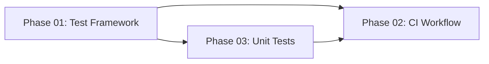

# Frontend CI with GitHub Actions

## Overview

Create a GitHub Actions CI workflow for the Next.js 16 frontend project with automated linting, type checking, testing, production builds, semantic version bumping, and GitHub releases.

## Current State

| Item | Status |
|------|--------|
| Package manager | npm (package-lock.json) |
| Node version | 20 LTS |
| Next.js | 16.1.3 |
| ESLint | v9 (flat config) |
| TypeScript | v5 |
| Test framework | Vitest 4.0.17 (configured) |
| Current version | 0.1.0 |
| Existing CI | None |

## Implementation Phases

| Phase | Name | Status | Effort | Description |
|-------|------|--------|--------|-------------|
| 01 | [Setup Test Framework](phase-01-setup-test-framework.md) | done | 1h | Install Vitest, configure for Next.js |
| 02 | [Create CI Workflow](phase-02-create-ci-workflow.md) | done | 1.5h | GitHub Actions workflow with version-bump, lint, test, build, release |
| 03 | [Write Unit Tests](phase-03-write-unit-tests.md) | done | 1h | Unit tests for utilities (ApiError, env config, formatters) |

## CI Pipeline Design

```
┌─────────────────────────────────────────────────────────────────────────────┐
│                         GitHub Actions CI Pipeline                          │
├─────────────────────────────────────────────────────────────────────────────┤
│                                                                             │
│  ┌─────────────────────────── On Pull Request ───────────────────────────┐  │
│  │                                                                       │  │
│  │  ┌──────────────────┐                                                 │  │
│  │  │   Version Bump   │  ← Reads PR labels (version:major/minor/patch) │  │
│  │  │                  │    Compares vs main, updates package.json       │  │
│  │  └────────┬─────────┘                                                 │  │
│  │           │                                                           │  │
│  │           ▼                                                           │  │
│  │  ┌────────────────┐    ┌────────────────┐                            │  │
│  │  │      Lint      │    │   Type Check   │  ← Run in parallel         │  │
│  │  └───────┬────────┘    └───────┬────────┘                            │  │
│  │          │                     │                                      │  │
│  │          └──────────┬──────────┘                                      │  │
│  │                     ▼                                                 │  │
│  │              ┌──────────────┐                                         │  │
│  │              │    Tests     │                                         │  │
│  │              └──────┬───────┘                                         │  │
│  │                     ▼                                                 │  │
│  │              ┌──────────────┐                                         │  │
│  │              │    Build     │                                         │  │
│  │              └──────────────┘                                         │  │
│  │                                                                       │  │
│  └───────────────────────────────────────────────────────────────────────┘  │
│                                                                             │
│  ┌────────────────────── On Push to Main ────────────────────────────────┐  │
│  │                                                                       │  │
│  │  ┌──────────────────┐                                                 │  │
│  │  │     Release      │  ← Creates git tag v{version}                  │  │
│  │  │                  │    Creates GitHub release                       │  │
│  │  └──────────────────┘                                                 │  │
│  │                                                                       │  │
│  └───────────────────────────────────────────────────────────────────────┘  │
│                                                                             │
└─────────────────────────────────────────────────────────────────────────────┘
```

## Version Bump Flow

```
PR created → Label added (version:patch) → CI runs:
  1. Get main version (e.g., 0.1.0)
  2. Get PR version (e.g., 0.1.0)
  3. Compare: PR == main? → Bump needed
  4. Calculate: patch → 0.1.1
  5. Run: npm version 0.1.1 --no-git-tag-version
  6. Commit: "chore: bump version to 0.1.1"
  7. Continue CI with updated version

PR merged → Push to main → Release job:
  1. Read version from package.json (0.1.1)
  2. Check if tag v0.1.1 exists
  3. If not: create tag + GitHub release
```

## Files to Create/Modify

| File | Purpose | Phase |
|------|---------|-------|
| `vitest.config.ts` | Vitest configuration | 01 (done) |
| `src/__tests__/setup.test.ts` | Example test file | 01 (done) |
| `.github/workflows/ci.yml` | Main CI workflow | 02 |
| `src/__tests__/api-error.test.ts` | ApiError class tests | 03 |
| `src/__tests__/env-config.test.ts` | Environment config tests | 03 |
| `src/lib/utils/formatters.ts` | Utility formatters | 03 |
| `src/__tests__/formatters.test.ts` | Formatter tests | 03 |

## GitHub Labels Required

Create these labels in repository settings:

| Label | Color | Description |
|-------|-------|-------------|
| `version:major` | `#B60205` | Major version bump (breaking changes) |
| `version:minor` | `#0E8A16` | Minor version bump (new features) |
| `version:patch` | `#1D76DB` | Patch version bump (bug fixes) |

## Success Criteria

### CI Workflow
- [x] CI runs on every PR and push to main
- [x] Lint stage uses ESLint 9 flat config
- [x] Type check runs `tsc --noEmit`
- [x] Tests run with Vitest
- [x] Build produces production bundle
- [x] npm dependencies cached for speed
- [x] Pipeline fails fast on any error

### Version Bumping
- [x] Version bump reads PR labels correctly
- [x] Version bump compares PR vs main version
- [x] Version bump skips if already bumped
- [x] Version bump commits to PR branch
- [x] Supports major/minor/patch increments

### Releases
- [x] Release job runs only on push to main
- [x] Creates git tag with version (v0.1.1)
- [x] Creates GitHub release with changelog link
- [x] Skips if tag already exists (idempotent)

### Unit Tests
- [x] ApiError class fully tested (5 tests)
- [x] Environment config tested (6 tests)
- [x] Utility formatters tested (21 tests)
- [x] All tests pass in < 10 seconds (34 tests in 396ms)

## Dependencies



- Phase 02 depends on Phase 01 (test command must exist)
- Phase 03 can run in parallel with Phase 02
- Phase 02 tests are validated when Phase 03 completes
